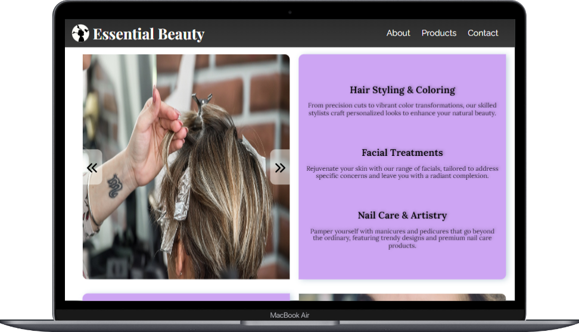

<div style="text-align:center"><h1> Freecodecamp Cerfification - Landing Page</h1></div>

  

This is my fourth project to Responsive Web Design Certification [Responsive Web Design](https://www.freecodecamp.org/learn/2022/responsive-web-design/). Freecodecamp certifications help you improve your coding skills by building realistic projects.

  

## Table of contents

  

- [Table of contents](#table-of-contents)
- [Overview](#overview)
  - [The Project](#the-project)
  - [Screenshot](#screenshot)
  - [Links](#links)
- [My process](#my-process)
  - [Built with](#built-with)
  - [What I learned](#what-i-learned)
    - [**Scroll Reveal**](#scroll-reveal)
    - [**Grid Layouts**](#grid-layouts)
    - [**Image Sliders**](#image-sliders)
  - [Form Validation](#form-validation)
  - [Box-shadow style function](#box-shadow-style-function)
  - [Label Animations](#label-animations)
  - [isInputValid() and isInputInvalid() Function](#isinputvalid-and-isinputinvalid-function)
  - [Creating Span](#creating-span)
  - [Continued development](#continued-development)
- [Author](#author)
- [Acknowledgments](#acknowledgments)

  

## Overview

  

### The Project

  

Users should be able to:

  

1. Your product landing page should have a header element with a corresponding <code>id="header"</code>
2. You can see an image within the header element with a corresponding <code>id="header-img"</code> (A logo would make a good image here)
3. Within the <code>#header</code> element, you can see a <code>nav</code> element with a corresponding <code>id="nav-bar"</code>
4. You can see at least three clickable elements inside the <code>nav</code> element, each with the class <code>nav-link</code>
5. When you click a <code>.nav-link</code> button in the <code>nav</code> element, you are taken to the corresponding section of the landing page
6. You can watch an embedded product video with <code>id="video"</code>
7. Your landing page has a form element with a corresponding <code>id="form"</code>
8. Within the form, there is an input field with <code>id="email"</code> where you can enter an email address
9. The <code>#email</code> input field should have placeholder text to let users know what the field is for
10. The <code>#email</code> input field uses HTML5 validation to confirm that the entered text is an email address
11. Within the form, there is a submit <code>input</code> with a corresponding <code>id="submit"</code>
12. When you click the <code>#submit</code> element, the email is submitted to a static page <code>(use this mock URL: https://www.freecodecamp.com/email-submit)</code>
13. The navbar should always be at the top of the viewport
14. Your product landing page should have at least one media query
15. Your product landing page should utilize CSS flexbox at least once

  

### Screenshot

  


  

Add a screenshot of your solution. The easiest way to do this is to use Firefox to view your project, right-click the page and select "Take a Screenshot". You can choose either a full-height screenshot or a cropped one based on how long the page is. If it's very long, it might be best to crop it.

  

Alternatively, you can use a tool like [FireShot](https://getfireshot.com/) to take the screenshot. FireShot has a free option, so you don't need to purchase it.

  

Then crop/optimize/edit your image however you like, add it to your project, and update the file path in the image above.

  
  

### Links

  

- Repository URL: [Add solution URL here](https://github.com/Mateus-A-Carvalho/fcc-landing-page)

- Live Site URL: [Add live site URL here](https://mateus-a-carvalho.github.io/fcc-landing-page/)

  

## My process

  

### Built with

  

- Semantic HTML5 markup
- CSS custom properties
- Flexbox
- CSS Grid
- Mobile-first workflow
- [Scroll Reveal](https://scrollrevealjs.org/) - JS Library
- [Animista](https://animista.net/) - CSS Library

  

### What I learned
This section show some new knowledges that I learned in this project.


#### **Scroll Reveal**

As you can read in his own website: 

>*"ScrollReveal is a JavaScript library for easily animating elements as they enter/leave the viewport. It was designed to be robust and flexible, but hopefully you’ll be surprised below at how easy it is to pick up".*

This library simplify animation usage in our projects. Basiclly, `ScrollReveal()` constructor function are called, providing us ***ScrollReveal*** instance. There is so many things to do with this library but the most of time we will use ``reveal()`` method to creation animation wanted. In my project, I had idea to put the ``.products-img__container-wrapper`` and ``.products-img__container-wrapper`` in opposites sides, appearing smoothly when the user reach the frame, the first set starting with imgs and texts and the second starting with texts and imgs. The code that to implement this animation is bellow, with it's syntax:

>``ScrollReveal().reveal(target, options);``

1. **Target**: Using a CSS class selector, you can aim either element to apply animation;
2. **Options**: This is an object that tou can passa any property descripted in [ScrollReveal documentation.](https://scrollrevealjs.org/api/reveal.html)


```javascript
// Using ScrollReveal Library

// Animating the descriptions containers;
ScrollReveal().reveal('.description-container:nth-of-type(1)' ,{ 
  distance: '100px',
  origin: 'left'
});

ScrollReveal().reveal('.description-container:nth-of-type(2)' ,{ 
  distance: '100px',
  origin: 'right'
});

// Animating products section
ScrollReveal().reveal('.products-img__container-wrapper:nth-of-type(1)' ,{ 
  distance: '100px',
  origin: 'top'
});

ScrollReveal().reveal('.products-img__container-wrapper:nth-of-type(2)' ,{ 
  distance: '100px',
  origin: 'top'
});

ScrollReveal().reveal('.products__name' ,{ 
  distance: '100px',
  origin: 'bottom'
});

ScrollReveal().reveal('.product-descriptor' ,{ 
  distance: '100px',
  origin: 'bottom'
});
```
The code above set the ``distance`` that the element you move between it appear until the final of transition and the ``origin`` of this animation.

  


  

#### <h4 style="color:red">**Grid Layouts**</h4>

  

In this project I starded to work with Grid Layout. This is a skill that I have to improve. Here is the code that I implemented to style the images and text of products. In Desktop View you can see them side by side.

  

In ***Desktop View***, I decided to show side-by-side other.

  
**Desktop View**


  
```css

/* PRODUCTS SECTION */
section#products {
  display:  grid; /* Defining Grid Layout */
  grid-template-columns:  repeat(2, 50%);
  grid-template-rows:  repeat(2, 1fr);
  height:  auto;
  padding:  8.5rem  5rem;
  gap:  1rem  2.5rem;
  font-family:  var(--body-font);
}

```

```css

/* Products sliders */
.products-img__container-wrapper:nth-of-type(1) {
  grid-row:  1 / 2;
  border-radius:  var(--inverted-border-radius);
}

.products-img__container-wrapper:nth-of-type(2) {
  grid-row:  2 / -1;
  grid-column:  2/ -1;
  border-radius:  var(--inverted-border-radius);
  justify-content:  start;
}
```

```css

/* CONTAINER WITH SERVICES/PRODUCTS DESCRIPTORS */
.products-text__container-wrapper:nth-of-type(1) {
  grid-row:  1 / 2;
}

.products-text__container-wrapper:nth-of-type(2) {
  grid-row:  2 / -1;
}

```

**Mobile View**

In ***mobile view***, I decided to show one under other.

```css

section#products {
  display:  grid;
  grid-template-columns:  repeat(1, 100%);
  grid-template-rows:  repeat(4, 1fr);
  height:  auto;
  padding:  8.5rem  2.5rem;
  gap:  .5rem;
  font-family:  var(--body-font);
}

  

.products-img__container-wrapper:nth-of-type(1) {
  grid-column:  1 / -1;
  grid-row:  1 / 2; 
}

.products-text__container-wrapper:nth-of-type(1) {
  grid-column:  1 / -1;
  grid-row:  2 / 3;
}

.products-img__container-wrapper:nth-of-type(2) {
  grid-column:  1 / -1;
  grid-row:  3 / 4;
}

.products-text__container-wrapper:nth-of-type(2) {
  grid-column:  1 / -1;
  grid-row:  4 / -1;
}

```

  

---

  

#### **Image Sliders**

**Controls**

This part of code I implemented what I learned in a Youtube tutorial's. In the code bellow, the variables <code>firstCurrentImg</code> and <code>secondCurrentImg</code> are controls that check the lenght of <code>firstContainerProductsImgEl</code> and <code>secondContainerProductsImgEl</code>. The Event Handle will check if the target of event type contains the class that refers to images and pass this target as a parameter in the <code>updateImg()</code>.

  

``` javascript

// Img control;
let  firstCurrentImg = 1;
let  secondCurrentImg = 1;

bodyEl.addEventListener('click', (e) => {
  if(e.target.classList.contains('first-container__btn-next')) {
    updateImg('first', e.target);
  }
  
  if(e.target.classList.contains('first-container__btn-prev')) {
    updateImg('first', e.target);
  }

  if(e.target.classList.contains('second-container__btn-next')) {
    updateImg('second', e.target);
  }

  if(e.target.classList.contains('second-container__btn-prev')) {
    updateImg('second', e.target);
  }

})

 

```

**<code>UpdateImg()</code> function**  

In this code bellow, the <code>updateImg()</code> takes *two parameters*, the *first* tells us which container the we clicking. The *second* parameter passes button type to check the class name. After <code>if/else</code> statement checks the firsts parameters and knows if is first or second, we icrement the **image control's**. After it, we checks two things: <br>

  
1. If image control(<code>firstCurrentImg</code> or <code>secondCurrentImg</code>) is greater than its own lenght, them will be equal 1.

2. If image control is less than 1, them will be equal its own lenght.

This is the two basic verification before we set slide animation.

```javascript

function updateImg(containerNumber, btnType) {
    
    // Checking the parameter
    if(containerNumber === 'first' && btnType.classList.contains('btn-next')) {
      firstCurrentImg++;   
      
      // Img control
      if(firstCurrentImg > firstContainerProductsImgEl.length) {
        firstCurrentImg = 1;
      } else if(firstCurrentImg < 1) {
        firstCurrentImg = firstContainerProductsImgEl.length;
      }

      firstImgSlider.style.transform = `translateX(-${(firstCurrentImg - 1) * imgWidthValue}px)`;
      
    }

    if(containerNumber === 'first' && btnType.classList.contains('btn-prev')) {
      firstCurrentImg--;   
      
      // Img control
      if(firstCurrentImg > firstContainerProductsImgEl.length) {
        firstCurrentImg = 1;
      } else if(firstCurrentImg < 1) {
        firstCurrentImg = firstContainerProductsImgEl.length;
      }

      firstImgSlider.style.transform = `translateX(-${(firstCurrentImg - 1) * imgWidthValue}px)`;
     
    }

    if(containerNumber === 'second' && btnType.classList.contains('btn-next')) {
      secondCurrentImg++;   
      
      // Img control
      if(secondCurrentImg > secondContainerProductsImgEl.length) {
        secondCurrentImg = 1;
      } else if(secondCurrentImg < 1) {
        secondCurrentImg = secondContainerProductsImgEl.length;
      }

      secondImgSlider.style.transform = `translateX(-${(secondCurrentImg - 1) * imgWidthValue}px)`;
      
    }

    if(containerNumber === 'second' && btnType.classList.contains('btn-prev')) {
      secondCurrentImg--;   
      
      // Img control
      if(secondCurrentImg > secondContainerProductsImgEl.length) {
        secondCurrentImg = 1;
      } else if(secondCurrentImg < 1) {
        secondCurrentImg = secondContainerProductsImgEl.length;
      }

      secondImgSlider.style.transform = `translateX(-${(secondCurrentImg - 1) * imgWidthValue}px)`;
      
    }

}

```

  

---

  

### Form Validation

This was the hardest part of my project. I needed to learn a bit of ***RegEx*** to check the inputs. Also, firstly I wanted to made modules and specific files to each function(Validade, Label Animation and etc...). But I realized that my code was very confused and with a lot of bug. So I decided to made the *validate* and other *functionalities* about form in the same file.

  

**Valitating**

  

First of all, we started with a event trigger "submit". Then, we catch this event with <code>e</code> parameter and prevent the form to send data without a validation, in <code>e.preventDefault();</code>.

After it, start a serie of <code>if/else</code> statements that will check each input to validate this form. I choose to put one of this validate to don't make it too big.

  

Accordingly to the requires, it should have a <code>input</code> with a <code>id="submit"</code>. This creates a error when we pass for all input validation's and call the <code>formEl.submit()</code> method's because this is overlaiding for other element with *submit* name. To solve this problem, I used the <code>.call()</code> function to call submit method's to form using heritage of <code>HTMLFormElement</code>.

  

```javascript

// Validating form;
formEl.addEventListener('submit', (e) => {
  e.preventDefault();

  
  

HTMLFormElement.prototype.submit.call(formEl); // Inheriting the submit method from HTMLFormElement and calling formEl as thisArg;

});

```

  
Here is the part that check inputs specifically. In <code>isEmailValid(email)</code> and <code>isPhoneNumberValid(phoneNumber)</code> functions I used a ***RegEx*** to accept the patterns. In phone number, I set the regex to accept only numbers of Brazil(My Country)/

  
```javascript

// Checking if email is valid with regex;
function isEmailValid(email) {
  // Creating a RegEx to validate email;
  const emailRegEx = new RegExp(
    /^[^\s]+@[^\s]+\.[^\s]+$/
  );

  if(emailRegEx.test(email)) {

    return true;
  }

  return false;
}

// Checking if first name input is valid;
function isFirstNameValid(firstName) {
  if(!firstName) {
    creatingSpan('Please, enter your first name', 'first-name');
    return true; // Returning true to use this value in the form validation;
  }

  return false; // Returning false to use this value in addInputValidateStyle() feature;
}

// Checking if last name input is valid;
function isLastNameValid(lastName) {
  if(!lastName) {
    creatingSpan('Please, enter your last name', 'last-name');
    return true;
  }

  return false;
}

// Checking if datetime input is valid;
function isDatetimeValid(datetime) {
  if(!datetime) {
    creatingSpan('Please, select your prefered date ', 'datetime');
    return true;
  } 

  return false;
}

// checking if phone number input is valid
function isPhoneNumberValid(phoneNumber) {
  const telNumberRegex = new RegExp( // Testing a Regex based in Brazilians DDD(between 11 to 99); 
    /^[1-9][1-9]9\d{4}\d{4}$/ // 
  );

  if(telNumberRegex.test(phoneNumber)) {
    return true;
  }

  return false;
}

  

// This function adds input box-shadow feature;
function addInputValidateStyle(input) {
  if(input.classList.contains('first-name') && !isFirstNameValid(input)) { // Based in class name and return values, add box-shadow;
    isInputValid(input);
  }

  if(input.classList.contains('last-name') && !isLastNameValid(input)) {
    isInputValid(input);
  }

  if(input.classList.contains('input-email') && !isEmailValid(input)) {
    isInputValid(input);
  }

  if(input.classList.contains('input-datetime') && !isDatetimeValid(input)) {
    isInputValid(input);
  }

  if(input.classList.contains('input-tel') && !isPhoneNumberValid(input)) {
    isInputValid(input);
  }

}

// Function to trigger animation and check input validation;
function labelAnimate(input) {

  // Function to trigger animation and check input validation
  input.addEventListener('focus', (e) => {

    labelEls.forEach(label => {
      if (input.dataset.name === label.dataset.name) {
        label.classList.add('label-animation-focus');
      }
    });
  });

  input.addEventListener('blur', (e) => {
    let element = e.target;

    labelEls.forEach(label => {
      if (input.dataset.name === label.dataset.name && !element.value) {
        label.classList.remove('label-animation-focus');
      }
    });
  });

}

```

---

### Box-shadow style function

  This functions receives input as parameters and check if has a class with input name **AND** denies theses values. Bellow I will explain this.

```javascript

// This function adds input box-shadow feature;
function addInputValidateStyle(input) {
  if(input.classList.contains('first-name') && !isFirstNameValid(input)) { // Based in class name and return values, add box-shadow;
    isInputValid(input);
  }

  if(input.classList.contains('last-name') && !isLastNameValid(input)) {
    isInputValid(input);
  }

  if(input.classList.contains('input-email') && !isEmailValid(input)) {
    isInputValid(input);
  }

  if(input.classList.contains('input-datetime') && !isDatetimeValid(input)) {
    isInputValid(input);
  }

  if(input.classList.contains('input-tel') && !isPhoneNumberValid(input)) {
    isInputValid(input);
  }

}

```

1. The first condition of <code>if/else</code> statements checks if input has a specifically class name.

2. After it, I deny the input value because if this functions is running, it's means that the verification passed the first block of <code>if/else</code> statement and got caughted in the <code>else</code> statement, returning **true**. Returning true is easier to check in this case.

3. If this block returns true, <code>isInputValid()</code> is invoked.

---

  

### Label Animations

This function makes label moves up when the input is focused.

```javascript

// Function to trigger animation and check input validation;
function labelAnimate(input) {

  // Function to trigger animation and check input validation
  input.addEventListener('focus', (e) => {

    labelEls.forEach(label => {
      if (input.dataset.name === label.dataset.name) {
        label.classList.add('label-animation-focus');
      }
    });
  });

  input.addEventListener('blur', (e) => {
    let element = e.target;

    labelEls.forEach(label => {
      if (input.dataset.name === label.dataset.name && !element.value) {
        label.classList.remove('label-animation-focus');
      }
    });
  });

}

```

Treating of *Javascript*, this function receives an input as argument and works in an event listerner. The operation of this function is very simple: It will check if **input** has the same <code>data-set</code> of **label** for each ***event type***. Here I worked with <code>focus</code> and <code>blur</code> events.

  

In ***HTML*** and ***CSS*** there is some settings to follow.

1.  <code>Input</code> and <code>label</code> must be inside a container and input must be the first. This is because a **sibling css selector** is used to trigger the style of label.

  

```html

<div class="input-wrapper">

  <div class="input-names__wrapper container-input" data-name="first-name">
    <input type="text" id="first-name" class="input-name first-name" data-name="first-name" autocomplete="false">
    <label for="first-name" class="input-label__name first-name__label" data-name="first-name">First Name</label>
  </div>

  <div class="input-names__wrapper container-input" data-name="last-name">
    <input type="text" id="last-name" class="input-name last-name" data-name="last-name" autocomplete="false">
    <label for="last-name" class="input-label__name last-name__label" data-name="last-name">Last Name</label>
  </div>

</div>

```

  

2. In ***CSS*** you must to configure labels to has the following styles:

```css

.input-label__name,
.label-email,
.label-input__tel {
  width:  max-content;
  position:  relative;
  text-align:  left;
  top:  -25px;
  left:  5px;
  font-style:  italic;
  pointer-events:  none;
}

```

It allow that labels get positioned right below input. For label stay in same position of input, I setted <code>top: -25px</code>. The animation will happen with some styles in a specific class that will be added with ***Javascript***

  

```css

label.label-animation-focus {
  top:  -50px;
  font-size:  .8em;
}

```

  

**This effect is very simple**: When input is focused and has some value, label will move up <code>top: -50px</code>(***remember that -50px because label already stay at <code>top: -25px</code>***) and <code>font-size: .8rem</code> to dicrease this size. When input is blured, the class is removed and these styles return to normal.

To ensure that this animation will works I invoked this function in at the beggining of the code.

---
### isInputValid() and isInputInvalid() Function

The <code>isInputValid()</code> function is very easy to explain. Every time that this function is invoked, I add a class called <code>input-valid</code>. 

```javascript

// Cheking the input invalid;
function isInputInvalid(input) {
  labelEls.forEach(label => {
    if(input.dataset.name === label.dataset.name) {
      label.classList.add('shake-horizontal');

      setTimeout(() => {
        label.classList.remove('shake-horizontal');
      }, 2000)
    }
  })
  
  input.classList.toggle('shake-horizontal');
  input.classList.toggle('input-invalid');

  setTimeout(() => {
    input.classList.toggle('shake-horizontal');
    input.classList.toggle('input-invalid');
  }, 2000)
}

  

// Adding box-shadow in input valid;
function  isInputValid(input) {
  input.classList.add('input-valid')
}
```

The `isInputInvalid()` function works a little different. I used a `forEach() `method to verify if input and label are the same, using `data-set*` to link them. Testing `true`, it will add in label a class `shake-horizontal`. Then, I set a `setTimeout()`method to delete this class added. 

The ``isInputValid()`` just add a class ``input-valid`` with box-shadow when it is verified 

---

### Creating Span

The last function that I implemented in this project is ``createSpan()``

```javascript
// Creating a span element to warn the input invalid;
function creatingSpan(message, inputType) {
  const spanEl = document.createElement('span');

  containerInputsEl.forEach(container => {
    if(inputType === container.dataset.name) {
      if(container.dataset.name === 'datetime') {
        spanEl.style.top = '5px';
      }

      spanEl.remove();
      container.appendChild(spanEl);
      spanEl.innerHTML = `${message}`
    }
  })

  setTimeout(() => {
    spanEl.remove();
  }, 2000)
}
```

This function has *two* parameters: ***message*** and ***inputType***. First of all, this function creates a ``span`` element. In this part I used a ``forEach()`` method to iterate every ``containerInputEl`` and check ``dataset.name`` to set correctly height of label in datetime input. In others inputs, it wasn't necessary. 

After it, I delete any span that once was created. I made this because every time that this function is involked, it creates a new ``span``. If I click consecutive times in submit button, it will create a lot of ``span`` elements. 

In the next line, this function add the ``span`` element in container with ``container.appendChild(spanEl);``. Then, the third line of this part of code, ``span`` element receives the *message* in parameters.

Outside this code, I implemented a ``setTimeout()`` to remove ``span`` every 2000ms(*seconds*).

---

  

### Continued development

  This project was very interesting to me. I did more than what was required. One of functionalities that I want to implement in future is integrate the form with some API that receive the data of form and send an email to user. Also, in this project used ***Lighthouse*** of ***Dev Tools*** and I will use it in every project. Finally, I'm going to start use ***Mobile First*** concept. Bellow I told which improvements I will do in the next projects.

  - **Properly size images;**
  - **Preconnect to required origins;**
  - **Largest contentful Paint element;**
  - **Eliminate render-blocking resources;**
  - **Enable text compression;**
  - **Minify CSS;**
  - **Page prevented back/foward cache restoration;**
  - **Images elementes don't have explict `width` and ``height``;**
  - **Minify Javascript;** 
  - **Serve images in next-gen formats;**
  - **Serve static assets with an efficient cache policy;**
  - **Ensure text remains visible dduring webfont load;**
  - **Defer offscreen images;**
  - **Recuce unused CSS;**
  - **Avoid enormous network payloads;**
  - **Avoidd large layout shifts;**
  - **Avoid non-composited animations;**
  - **Initial server response time was short;**
  - **Avois an axcessive DOM size;**
  - **Avoid chaining critical requests;**
  - **Javascript execution time;**
  - **Minimizes main-thread work;**
  - **Minimize third-party usage;**
  - **Avoid long main-thread tasks;**
  
  In ***Accessibility*** there are those improvements to do:

  - **Images elements don't have ``[alt]`` attibutes;**
  - **Form elements don't have associated labels;**
  - **``video`` elements contain a ``track`` element with ``[kind="captions"]``;**

  In ***Best Practices*** there are these improvements to do:

  - **Displays images with incorrect aspect ratio;**
  - **Ensure CSP is effective against XSS attacks;**

  In ***SEO*** there are those improvements to do:

  - **Document doesn't have a meta description;**
  - **Images elements don't have ``[alt]`` attributes;**

This is a long list of something to study and improve in the next projects.

---

## Author

  

- Website - [Add your name here](https://www.your-site.com)

- Frontend Mentor - [@Mateus-A-Carvalho](https://www.frontendmentor.io/profile/Mateus-A-Carvalho)

- Twitter - [@O_DevCarvalho](https://x.com/O_DevCarvalho)

- Linkedin - [Mateus A. Carvalho](https://www.linkedin.com/in/mateus-a-carvalho/)

- Instagram - [@OMateusCarvalhoDev](https://www.instagram.com/o.mateus.carvalho.dev/)


## Acknowledgments

  In this project I learned more about ***how can I validate a form***, ***RegEx*** and starts to use some libraries as [Scroll Reveal JS](https://scrollrevealjs.org/). 

